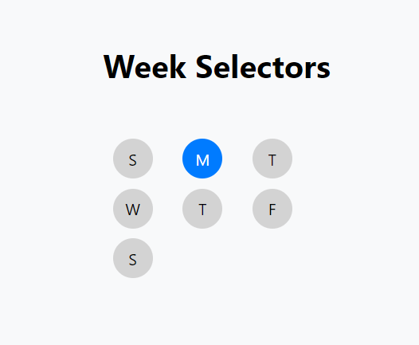
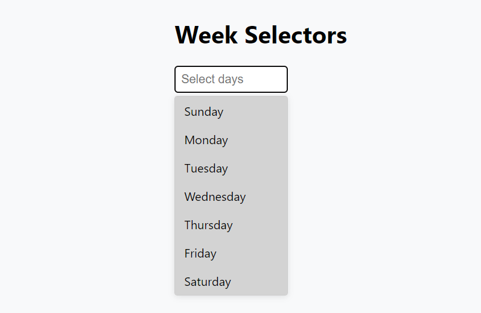
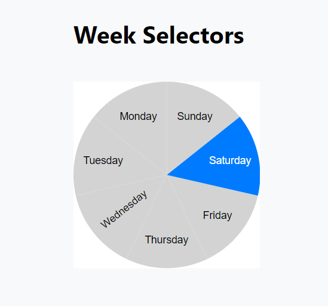
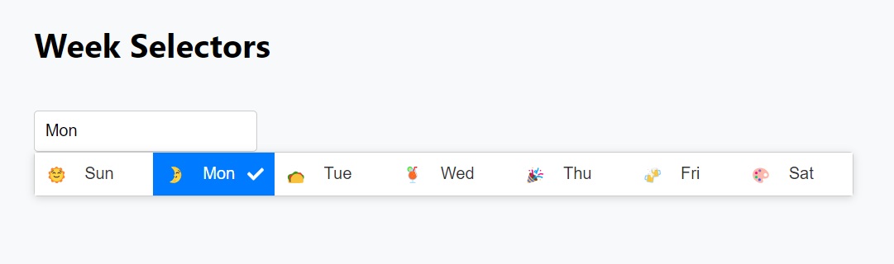

# reactjs-weekdays-picker

[](https://badge.fury.io/js/reactjs-weekdays-picker) [](https://www.npmjs.com/package/reactjs-weekdays-picker) [](https://www.npmjs.com/package/reactjs-weekdays-picker)

A customizable React module for day selection with various components like dropdown selectors, circular day pickers, and custom menu selectors.

## Installation

[](https://nodei.co/npm/reactjs-weekdays-picker/)

#### To install the latest stable version:

```bash
npm install --save reactjs-weekdays-picker
```

## Usage

### 1. DefaultSelector

A circular day picker component with customizable day length display and multiple selection options.



```jsx
import React, { useState } from 'react';
import { DefaultSelector } from 'reactjs-weekdays-picker';

export default function App() {
  const [selectedDays, setSelectedDays] = useState([]);

  return (
    <DefaultSelector
      multiple={true}
      state={selectedDays}
      setState={setSelectedDays}
      dayList={['Sunday', 'Monday', 'Tuesday', 'Wednesday', 'Thursday', 'Friday', 'Saturday']}
      selectedColor="#007bff"
      unselectedColor="#d3d3d3"
      selectedTextColor="#ffffff"
      unselectedTextColor="#000000"
      width="200px"
      displayLength={3}  // Display the first three characters of each day name
    />
  );
}
```

### 2. DropdownSelector

A dropdown component that allows users to select one or more days from a list.



```jsx
import React, { useState } from 'react';
import { DropdownSelector } from 'reactjs-weekdays-picker';

export default function App() {
  const [selectedDays, setSelectedDays] = useState([]);

  return (
    <DropdownSelector
      state={selectedDays}
      setState={setSelectedDays}
      dayList={['Monday', 'Tuesday', 'Wednesday', 'Thursday', 'Friday']}
      multiple={true}
      selectedColor="#007bff"
      unselectedColor="#d3d3d3"
      width="200px"
    />
  );
}
```

### 3. CircularDayPicker

A circular day picker component that visualizes selected days in a pie chart format.



```jsx
import React, { useState } from 'react';
import { CircularDayPicker } from 'reactjs-weekdays-picker';

export default function App() {
  const [selectedDays, setSelectedDays] = useState([]);

  return (
    <CircularDayPicker
      state={selectedDays}
      setState={setSelectedDays}
      dayList={['Mon', 'Tue', 'Wed', 'Thu', 'Fri']}
      selectedColor="#007bff"
      unselectedColor="#d3d3d3"
    />
  );
}
```

### 4. CustomMenuSelector

A custom dropdown component with tick icons for selected items.



```jsx
import React, { useState } from 'react';
import { CustomMenuSelector } from 'reactjs-weekdays-picker';

export default function App() {
  const [selectedDays, setSelectedDays] = useState([]);

  return (
    <CustomMenuSelector
      state={selectedDays}
      setState={setSelectedDays}
      dayList={['Sun', 'Mon', 'Tue', 'Wed', 'Thu', 'Fri', 'Sat']}
      selectedColor="#007bff"
      unselectedColor="#d3d3d3"
      placeholder="Select days"
    />
  );
}
```

## Props

### Common Props for All Components

| Name                 | Type     | Required | Default                                       | Description                                          |
|----------------------|----------|----------|-----------------------------------------------|------------------------------------------------------|
| `multiple`           | bool     | false    | `false`                                       | Whether to allow multiple selections.                |
| `dayList`            | array    | false    | `['Mon', 'Tue', 'Wed', 'Thu', 'Fri', 'Sat', 'Sun']` | List of days to display.                             |
| `state`              | array    | false    | `[]`                                          | State to manage selected days.                       |
| `setState`           | function | false    | `undefined`                                   | Function to update the state of selected days.       |
| `onDayChange`           | function | false    | `undefined`                                   | Callback function that triggers when the selected days change. Receives the updated array of selected days as an argument.       |
| `selectedColor`      | string   | false    | `#007bff`                                     | Background color for selected items.                 |
| `unselectedColor`    | string   | false    | `#d3d3d3`                                     | Background color for unselected items.               |
| `selectedTextColor`  | string   | false    | `#ffffff`                                     | Text color for selected items.                       |
| `unselectedTextColor`| string   | false    | `#000000`                                     | Text color for unselected items.                     |
| `fontSize`           | string   | false    | `inherit`                                     | Font size of the text.                               |
| `fontWeight`         | string   | false    | `normal`                                      | Font weight of the text.                             |
| `fontStyle`          | string   | false    | `normal`                                      | Font style of the text.                              |

### Additional Props for DefaultSelector

| Name                  | Type     | Required | Default  | Description                                   |
|-----------------------|----------|----------|----------|-----------------------------------------------|
| `width`              | string   | false    | `150px`                                       | Width of the component.                              |
| `selectedHoverColor`  | string   | false    | `#0056b3` | Hover color for selected items.               |
| `unselectedHoverColor`| string   | false    | `#f0f0f0` | Hover color for unselected items.             |
| `displayLength`       | number   | false    | `1`      | Number of characters to display for each day. |

### Additional Props for CircularDayPicker

| Name         | Type   | Required | Default | Description                                      |
|--------------|--------|----------|---------|--------------------------------------------------|
| `radius`     | number | false    | `100`   | Radius of the circular chart.                    |
| `strokeWidth`| number | false    | `10`    | Width of the stroke for the pie chart segments.  |
| `size`       | string | false    | `100px` | Size of the circular chart.                      |

### Additional Props for DropdownSelector

| Name                  | Type     | Required | Default         | Description                                   |
|-----------------------|----------|----------|-----------------|-----------------------------------------------|
| `width`              | string   | false    | `150px`                                       | Width of the component.                              |
| `inputTextColor`      | string   | false    | `#000000`       | Color of the input text.                      |
| `placeholder`         | string   | false    | `Select days`   | Placeholder text for the dropdown input.      |

### Additional Props for CustomMenuSelector

| Name           | Type   | Required | Default         | Description                                    |
|----------------|--------|----------|-----------------|------------------------------------------------|
| `width`              | string   | false    | `auto`                                       | Width of the component.                              |
| `inputTextColor`| string | false    | `#000000`       | Color of the input text.                       |
| `placeholder`   | string | false    | `Select days`   | Placeholder text for the dropdown input.       |
| `iconAlign`     | string | false    | `right`         | Alignment of icons in the dropdown menu.       |
| `displayOption` | string | false    | `both`          | Determines what to display: icons, text, or both. |
| `showIcons`     | bool   | false    | `true`          | Whether to display icons next to the items.    |
| `showTicks`     | bool   | false    | `true`          | Whether to show ticks for selected items.      |
| `excludeDays`   | array  | false    | `[]`            | List of days to exclude from the menu.         |
| `iconOrder`     | number | false    | `1`             | Order of the icons in the dropdown.            |
| `dayOrder`      | number | false    | `2`             | Order of the day names in the dropdown.        |
| `tickOrder`     | number | false    | `3`             | Order of the tick marks in the dropdown.       |

## License

This project is licensed under the MIT License - see the [LICENSE](./LICENSE) file for details.

## Contributing

We welcome contributions! Please open an issue or submit a pull request for any feature requests or bug fixes.